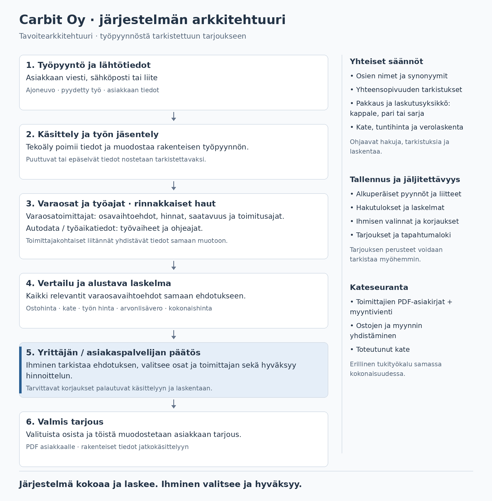
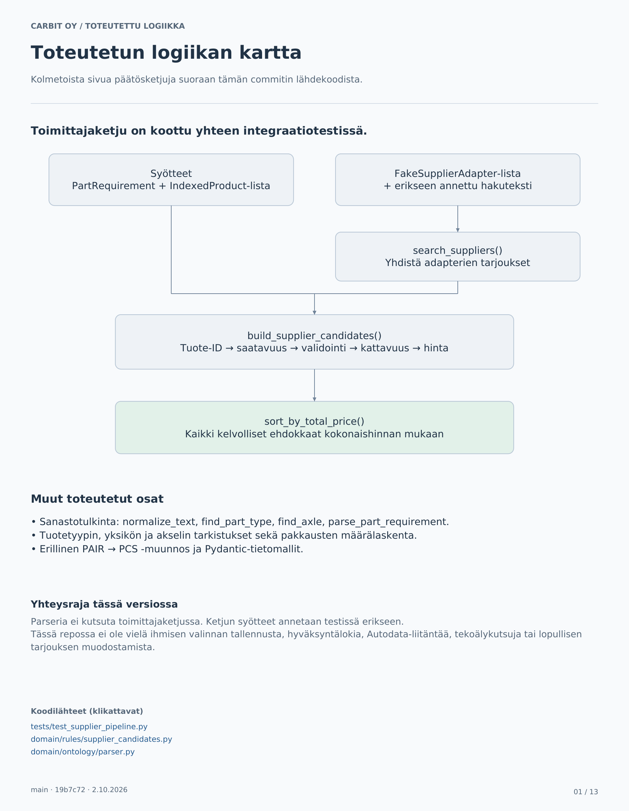
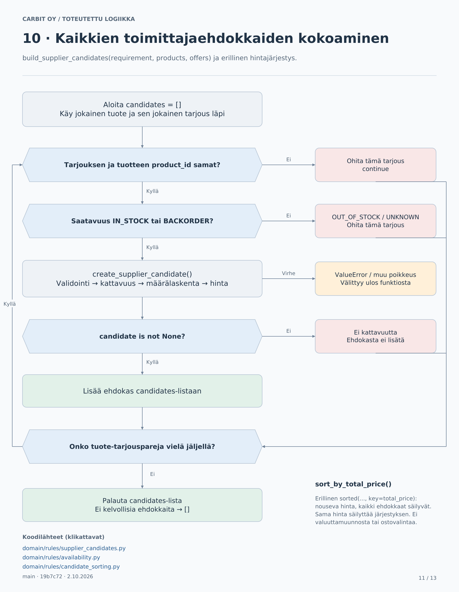

# Carbit Oy - arkkitehtuuri ja päätöspuut

Visualisoinnit laadittu 2.10.2026.

## Tavoitearkkitehtuuri

Yrittäjälle tarkoitettu kokonaiskuva kuvaa projektin tavoitetta. Kaikki kuvan liitännät ja vaiheet eivät ole vielä toteutettuja.

## Toteutetut päätösketjut

Nämä päätöspuut kuvaavat lähdekoodia commitissa [`19b7c72`](https://github.com/elissei/CarbitOy/tree/19b7c7255c53a19af6944f65fe8ebfe7b7b0603e). Ne ovat tämän version dokumentoitu tilannekuva; myöhemmät koodimuutokset eivät päivity niihin automaattisesti.

- [Kaikki päätöspuut PDF-muodossa](Carbit-toteutetut-paatospuut.pdf) (13 sivua; klikattavat koodilähteet)

| Sivu | Sisältö | Kuva |
| --- | --- | --- |
| 1 | Toteutetun logiikan kartta | [PNG](decision-trees/Carbit-paatospuu-01.png) |
| 2 | Tekstistä varaosatarpeeksi | [PNG](decision-trees/Carbit-paatospuu-02.png) |
| 3 | Sanastohakujen apupuut | [PNG](decision-trees/Carbit-paatospuu-03.png) |
| 4 | Akselin tulkinta | [PNG](decision-trees/Carbit-paatospuu-04.png) |
| 5 | Tuotteen kattavuuden tarkistukset | [PNG](decision-trees/Carbit-paatospuu-05.png) |
| 6 | Akseli- ja yksikköapufunktiot | [PNG](decision-trees/Carbit-paatospuu-06.png) |
| 7 | Erillinen muunto kappaleiksi | [PNG](decision-trees/Carbit-paatospuu-07.png) |
| 8 | Pakkausmäärän laskenta | [PNG](decision-trees/Carbit-paatospuu-08.png) |
| 9 | Toimittajatarjouksen validointi | [PNG](decision-trees/Carbit-paatospuu-09.png) |
| 10 | Yhden ehdokkaan muodostaminen | [PNG](decision-trees/Carbit-paatospuu-10.png) |
| 11 | Kaikkien toimittajaehdokkaiden kokoaminen | [PNG](decision-trees/Carbit-paatospuu-11.png) |
| 12 | Hakuliitäntöjen silmukka | [PNG](decision-trees/Carbit-paatospuu-12.png) |
| 13 | Tietomallit, sanastot ja latauksen rajat | [PNG](decision-trees/Carbit-paatospuu-13.png) |

### Kokonaiskartta

### Ehdokkaiden päätösketju

